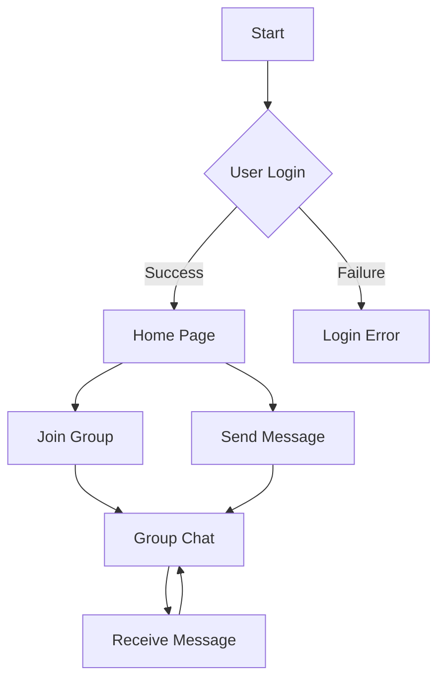

```markdown
# 🎨 DOUBTLESS 🚀 by IshitaPathak

```ascii
      _,-._
     / \_/ \
    >-(_)-<
    \_/ \_/
      `-'
```

**Tagline:**  Connecting Learners, Empowering Knowledge ✨

<br>

[](https://www.cplusplus.com/)
[](https://aws.amazon.com/)
[](https://flutter.dev/)
[](https://firebase.google.com/)


---

## 🌟 Feature Highlights 💫

- 🚀 **Real-time Chat:**  Connect with experts and peers instantly.
- 📚 **Organized Groups:** Find communities based on your learning goals.
- 💡 **Expert Guidance:** Get help from experienced individuals.
- 🛠️ **Seamless Integration:** Easy-to-use interface for a smooth experience.
- 📊 **Progress Tracking:** Monitor your learning journey.
- 📱 **Cross-Platform:**  Accessible on various devices.
- ⚡ **Fast Problem Solving:** Get quick answers to your questions.


---

## 🛠️ Tech Stack 💻

| Technology       | Badge                                                                   | Description                                                                    |
|-----------------|---------------------------------------------------------------------------|--------------------------------------------------------------------------------|
| C++              | [](https://www.cplusplus.com/) | Core backend logic.                                                              |
| AWS              | [](https://aws.amazon.com/) | Cloud infrastructure.                                                            |
| Flutter          | [](https://flutter.dev/) | Cross-platform UI framework.                                                     |
| Firebase         | [](https://firebase.google.com/) | Backend services (Authentication, Firestore).                                   |


---

## 🚀 Quick Start ⚡

1. **Clone the repository:**
   ```bash
   git clone https://github.com/IshitaPathak/DOUBTLESS.git
   ```

2. **Install dependencies:**  (Instructions will vary depending on your setup)

3. **Run the application:** (Instructions will vary depending on your setup)


---

## 📖 Detailed Usage 📚

**Example 1: Joining a Group**

```cpp
// (C++ code example would go here demonstrating group joining)
```

**Example 2: Sending a Message**

```dart
// (Dart/Flutter code example would go here demonstrating message sending)
```


---

## 🏗️ Project Structure 📦

```
DOUBTLESS/
├── ios/
│   └── ...
├── android/
│   └── ...
├── lib/
│   ├── pages/
│   │   └── ...
│   ├── services/
│   │   └── ...
│   ├── widgets/
│   │   └── ...
│   └── ...
└── ...
```


---

## 🎯 API Documentation 📄

| Endpoint          | Method | Description                                      | Request Body     | Response Body          |
|-------------------|--------|--------------------------------------------------|-------------------|-------------------------|
| `/users`          | POST    | Create a new user.                             | `{username, email}` | `{id, username, email}` |
| `/groups/{id}`    | GET     | Get information about a specific group.         |                   | `{name, members, ...}`   |
| `/messages/{id}`  | POST    | Send a message to a group.                     | `{message, sender}` | `{}`                     |


---

## 🔧 Configuration Options ⚙️

| Option           | Type    | Default | Description                                          |
|-------------------|---------|---------|------------------------------------------------------|
| `database_url`   | String  | `...`   | URL of the database.                                  |
| `api_key`        | String  | `...`   | API key for authentication.                             |


---

## 📸 Screenshots/Demo 🖼️

**(Insert image galleries here using markdown image syntax.  Example below)**


---

## 🤝 Contributing Guidelines 🤝

1. Fork the repository.
2. Create a new branch.
3. Make your changes.
4. Test thoroughly.
5. Submit a pull request.


---

## 📜 License and Acknowledgments 🙏

This project is licensed under the [MIT License](LICENSE).  Thanks to [list contributors/libraries here].


---

## 👥 Contributors ✨

**(Insert contributor avatars and links here)**


---

## 📞 Support and Contact 📧

[](https://twitter.com/IshitaPathak)
[](mailto:your_email@example.com)


---

<details><summary><b>FAQ</b></summary>

- **Q: What languages are supported?** <br> A: Currently, we support English. More languages will be added soon.

- **Q: How can I report a bug?** <br> A: Please open an issue on the GitHub repository.

- **Q: What is the pricing model?** <br> A: Doubtless is currently free.

</details>

---

## Roadmap 🎯

- [ ] Implement user profiles
- [ ] Add group creation functionality
- [ ] Integrate with other learning platforms
- [x]  Initial release



```

